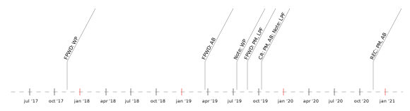

# Publication status and milestones of the Working Group documents
{: no_toc}

## Latest versions of documents

| Document | Latest official release | Editors’ Draft | Repository |
|----------|:-----------------------:|:--------------:|:----------:|
| Web Publications                             | [wd](https://www.w3.org/TR/wpub/) | [ed](https://w3c.github.io/wpub/)              | [wpub](https://github.com/w3c/wpub/)                  |
| Web Annotation Extensions for Web Publications  | [wd](https://www.w3.org/TR/wpub-ann/) | [ed](https://w3c.github.io/wpub-ann/)          | [publ-loc](https://github.com/w3c/wpub-ann/)          |
| Packaged Web Publications                    | [wd](https://www.w3.org/TR/pwpub/) | [ed](https://w3c.github.io/pwpub/)          | [pwpub](https://github.com/w3c/pwpub/)                |
| DPUB ARIA 2.0                                | (none yet) | ([ed](https://w3c.github.io/dpub-aria-2.0/))†  | [dpub-aria-2.0](https://github.com/w3c/dpub-aria-2.0) |
| EPUB4                                        | (none yet) | ([ed](https://w3c.github.io/epub4/))†          | [epub4](https://github.com/w3c/epub4/)                |
| Web Publications Use Cases and Requirements‡ | [note](https://www.w3.org/TR/pwp-ucr/) | [ed](https://w3c.github.io/dpub-pwp-ucr/)| [dpub-pwp-ucr/](https://github.com/w3c/dpub-pwp-ucr//)                |
{: .zebra}

†Only skeleton for now.   
‡Not a recommendation-track document
{: .smaller}

<!-- 

 -->

The Editors’ drafts are managed in GitHub repositories; the list of those repositories is available on the [GitHub index page](https://github.com/search?q=topic%3Apubl-wg+org%3Aw3c&type=Repositories).

## Major planned milestones

The milestones [have been updated](https://lists.w3.org/Archives/Public/public-publ-wg/2018Jun/0113.html), compared to the [charter](https://www.w3.org/2017/04/publ-wg-charter/#deliverables), on the 28th of June, 2018.

* Web Publications (WP):
    * First Public Working Draft (FPWD): Q4 2017
    * Candidate Recommendation (CR): Q2 2019.
    * Recommendation (REC): Q2 2020.
* Packaged Web Publications (PWP):
    * First Public Working Draft (FPWD): Q4 2017
    * On hold pending requirements and finalization of the [Web Packaging](https://github.com/WICG/webpackage) work
* EPUB 4:
    * First Public Working Draft (FPWD): Q4 2018.
    * Candidate Recommendation (CR): Q2 2019.
    * Recommendation (REC): Q2 2020.
* DPUB-ARIA 2.0:
    * On hold pending the timeline of the [ARIA 1.2](https://w3c.github.io/aria/) work

